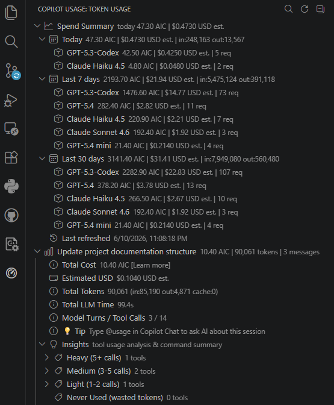

# Copilot Usage

GitHub Copilot Chat Usage is a lightweight VS Code extension for understanding where your Copilot Chat spend goes. It reads local VS Code Copilot Chat logs and shows cost, token, and tool-call breakdowns by conversation message.

This extension is not affiliated with GitHub or Microsoft.

GitHub documents Copilot usage in AI credits, where "1 AI credit = $0.01 USD" in the official [GitHub Copilot billing docs](https://docs.github.com/en/billing/concepts/product-billing/github-copilot-billing).



## Features

- See AIC, token, cache, model-turn, and duration totals for each message.
- Compare input, output, cached, and fresh-token usage across a session.
- Inspect built-in tool calls such as searches, file reads, edits, diagnostics, todos, and terminal commands.
- Use `@usage` in Copilot Chat to ask AI questions about the currently loaded session or recent sessions.
- Open the GitHub AI credits documentation directly from the AIC row.

## Setup

To get cost/token data, set this VS Code setting to `true`:

```text
github.copilot.chat.agentDebugLog.fileLogging.enabled
```

Then start a new Copilot Chat session and open the Copilot Usage activity bar view.

For Remote-SSH/remote workspaces, install this extension in the local VS Code client (UI side). Copilot chat usage files are written to local user storage, so local execution is required to collect session data.

The extension can also read VS Code `chatSessions` files for transcript and tool-call information when debug logs are missing or incomplete. Those files do not always contain billing totals.

## Privacy

This extension reads local VS Code/Copilot Chat storage files from your machine. It does not upload data by itself.

When you use the `@usage` chat participant, the extension sends the selected session summary to the VS Code language model you are using so it can answer your question. Session summaries may include message previews, tool names, terminal command summaries, token counts, and cost totals.

## Commands

- `Copilot Usage: Analyze Current Session`
- `Copilot Usage: Pick Session to Analyze`
- `Refresh`

## Development

For local development, building, testing, and extension publishing, see [Developer.md](Developer.md).

## Notes

VS Code and Copilot Chat log formats are not public stable APIs. The parser is intentionally tolerant, but some values are best-effort and may need updates if VS Code changes its persisted chat or debug-log schema.
