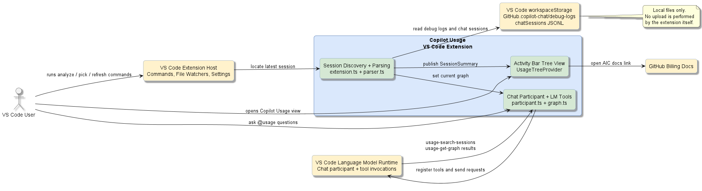
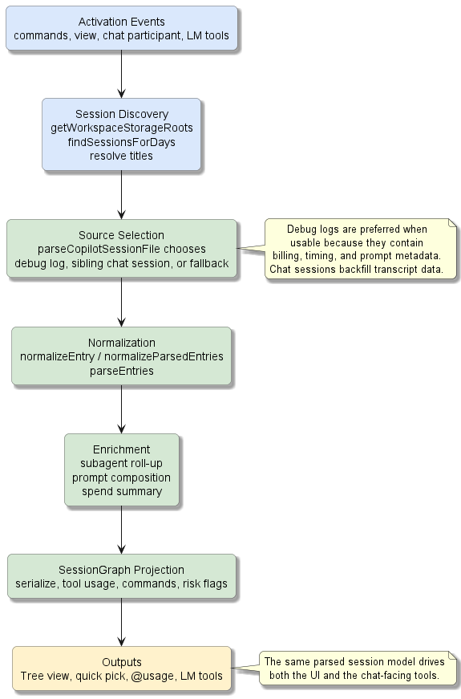
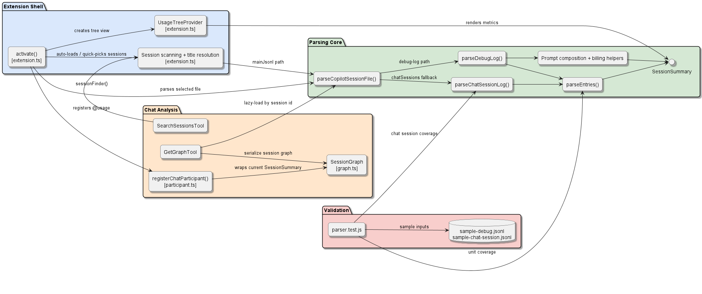

# Copilot Usage — Project Summary

## 1. Executive Summary

Copilot Usage is a lightweight VS Code extension that inspects locally stored Copilot Chat logs and turns them into per-session cost, token, timing, and tool-call insights. The extension scans VS Code workspace storage for `debug-logs` and `chatSessions` JSONL files, normalizes them into a common `SessionSummary` model, and presents the result in an activity-bar tree plus an `@usage` chat participant. The tree view is optimized for quick operational analysis, while the chat participant and language-model tools expose the same parsed session graph for ad hoc questions about cost patterns, commands, and risky operations. The implementation is intentionally local-first: it reads files from the developer machine and does not upload data on its own.

## 2. Architecture Overview



The repository contains a single TypeScript extension package with four source files under `src/`. The extension host entry point in `src/extension.ts` owns activation, session discovery, title resolution, spend-summary refresh, tree view population, and command registration. Parsing logic in `src/parser.ts` is the core data-processing layer: it detects the best available source file, tolerates multiple Copilot log shapes, merges system continuations, rolls subagent usage into parent messages, and enriches summaries with prompt-composition metadata. The chat-facing layer uses `src/participant.ts` and `src/graph.ts` to wrap the parsed session in a queryable `SessionGraph` that can be serialized for language-model analysis.

### High-level runtime responsibilities

| Area | Primary file | Responsibility |
| --- | --- | --- |
| Extension shell | `src/extension.ts` | Activation events, command registration, file watching, quick-pick session selection, tree rendering |
| Parsing core | `src/parser.ts` | JSONL normalization, session parsing, billing extraction, prompt/tool metadata analysis |
| Chat analysis | `src/participant.ts` | `@usage` participant, LM tool registration, request orchestration |
| Query layer | `src/graph.ts` | Session graph projection, tool/command aggregation, risk detection, LLM-friendly serialization |
| Tests | `test/parser.test.js` | Parser behavior and regression coverage |

## 3. Processing Pipeline



The processing path starts when VS Code activates the extension from a command, view, chat participant, or language-model tool contribution defined in `package.json`. `activate()` creates the tree view, wires settings listeners, auto-loads the newest session, starts a file watcher on the chosen session file, and registers the `@usage` participant plus three user commands.

### End-to-end flow

1. Session discovery locates candidate Copilot storage directories from standard VS Code paths and optional configured search roots.
2. The extension selects the newest likely session, preferring recent files with billing data when available.
3. `parseCopilotSessionFile()` chooses between a debug log, a sibling `chatSessions` transcript, or a fallback path depending on file quality and availability.
4. `parseDebugLog()` and `parseChatSessionLog()` normalize different persisted formats into a shared `LogEntry` list.
5. `parseEntries()` groups messages, model turns, and tool calls into a `SessionSummary`, merging system-generated continuation messages such as terminal notifications.
6. The parser enriches the summary with subagent roll-up totals and prompt-composition metadata extracted from referenced system-prompt and tools files.
7. `UsageTreeProvider` renders tree nodes for spend history, session totals, per-message metrics, prompt-size details, tool usage, and command groups.
8. `setCurrentGraph()` wraps the current summary in a `SessionGraph`, which powers `usage-search-sessions`, `usage-get-graph`, and the `@usage` participant.

### Key control points

| Control point | Behavior | Why it matters |
| --- | --- | --- |
| `safeQuickPeekHasBillingData()` in `src/extension.ts` | Biases auto-load toward sessions with billing totals | Improves the chance that the first loaded session has cost data |
| `parseCopilotSessionFile()` in `src/parser.ts` | Resolves whether to trust debug logs, transcript files, or both | Keeps the extension useful when one storage format is incomplete |
| `isSystemContinuation()` in `src/parser.ts` | Collapses terminal notifications and similar system chatter into the preceding message | Prevents inflated message counts and misleading cost attribution |
| `SessionGraph.serialize()` in `src/graph.ts` | Produces compact text for LLM analysis | Keeps the chat participant efficient and deterministic |

## 4. Core Components



The design is small but layered. `src/extension.ts` is the orchestrator. `src/parser.ts` owns the canonical domain model. `src/participant.ts` exposes that model to Copilot Chat, and `src/graph.ts` provides the analysis surface needed by both tools and the participant.

### Interfaces and implementations

| Contract or type | Implemented or used by | Notes |
| --- | --- | --- |
| `SessionSummary` | Produced in `src/parser.ts`, consumed in `src/extension.ts`, `src/graph.ts`, `src/participant.ts` | The central parsed-session contract |
| `vscode.TreeDataProvider<TreeItemData>` | `UsageTreeProvider` in `src/extension.ts` | Drives the activity-bar visualization |
| `vscode.LanguageModelTool<SearchInput>` | `SearchSessionsTool` in `src/participant.ts` | Searches sessions by title or ID across a date window |
| `vscode.LanguageModelTool<GetGraphInput>` | `GetGraphTool` in `src/participant.ts` | Loads or resolves a session graph for analysis |
| `SessionFinder` / `TitleResolver` function types | Bound in `registerChatParticipant()` | Decouple participant logic from storage-scanning details |

### Important components

| Component | File | Role |
| --- | --- | --- |
| `activate()` | `src/extension.ts` | Application bootstrap for the extension host |
| `UsageTreeProvider` | `src/extension.ts` | Converts session and spend summaries into a hierarchical UI |
| `parseEntries()` | `src/parser.ts` | Core reducer from normalized log entries to message-turn summaries |
| `parseDebugLog()` | `src/parser.ts` | Reads debug JSONL, removes title-generation noise, rolls up subagents |
| `parseChatSessionLog()` | `src/parser.ts` | Reconstructs session state from incremental transcript updates |
| `SessionGraph` | `src/graph.ts` | Lazy, immutable analysis view over a parsed session |
| `registerChatParticipant()` | `src/participant.ts` | Registers tools and the `@usage` assistant surface |

## 5. API Contracts / Message Schemas

This project does not expose an HTTP API. Its public contracts are internal TypeScript structures, VS Code contribution points, and language-model tool schemas declared in `package.json` and implemented in `src/participant.ts`.

### Session summary contract

| Property | Type | Meaning |
| --- | --- | --- |
| `sessionId` | `string` | Stable Copilot session identifier |
| `title` | `string?` | Best resolved session title from metadata, title files, or content |
| `userMessages` | `UserMessageSummary[]` | Parsed user-facing messages after continuation merging |
| `totalInputTokens` | `number` | Aggregate input tokens across all model turns |
| `totalOutputTokens` | `number` | Aggregate output tokens across all model turns |
| `totalCachedTokens` | `number` | Aggregate cached prompt tokens |
| `totalNanoAiu` | `number` | Billing total in nano AIU units |
| `modelTurnCount` | `number` | Total number of LLM turns in the session |
| `toolCallCount` | `number` | Total number of tool calls associated with those turns |
| `promptComposition` | `PromptComposition?` | Optional metadata about prompt and tool-definition size |

### Language-model tools

| Tool | Input fields | Output shape |
| --- | --- | --- |
| `usage-search-sessions` | `query?: string`, `daysBack?: number`, `limit?: number` | Text list of matching and recent session IDs with titles and timestamps |
| `usage-get-graph` | `sessionId?: string`, `includeMessages?: boolean`, `maxMessages?: number` | Serialized `SessionGraph` text with stats, tool usage, risks, commands, and optional messages |

### VS Code commands and views

| Contribution | Identifier | Purpose |
| --- | --- | --- |
| Command | `copilotUsageTracker.analyzeSession` | Load the most recent session |
| Command | `copilotUsageTracker.pickSession` | Open the interactive session picker |
| Command | `copilotUsageTracker.refresh` | Re-scan and refresh summaries |
| View container | `copilot-usage` | Activity-bar container for the dashboard |
| Tree view | `copilotUsageTree` | Main token-usage tree |
| Chat participant | `copilot-usage-tracker.usage` | User-facing `@usage` Copilot participant |

## 6. Infrastructure & Deployment

This repository packages a client-side VS Code extension rather than a network service. There is no `Dockerfile`, container orchestration manifest, or CI workflow in the repository. The primary runtime is the VS Code extension host, and the primary deployment artifact is a `.vsix` package.

### Runtime model

| Aspect | Observed implementation |
| --- | --- |
| Packaging | `vsce package` via `npm run package` |
| Build | TypeScript compile to `out/` via `tsc -p ./` |
| Test execution | `npm test` runs `npm run compile` and `node test/parser.test.js` |
| Node/TypeScript target | CommonJS, ES2022 target, output to `out/` |
| Storage dependencies | Local VS Code `workspaceStorage`, `debug-logs`, and `chatSessions` files |
| External integration | VS Code API, Copilot Chat language-model tools, GitHub billing documentation link |

### Operational behaviors

- The extension watches the currently loaded session file and reparses it on changes.
- A timed refresh recalculates spend summaries every five minutes while the extension is active.
- Search roots and recursion depth are configurable through the `copilotUsageTracker.searchRoots` and `copilotUsageTracker.maxSearchDepth` settings.
- Privacy posture is local-first: logs are read from disk; the `@usage` participant sends summarized session data only when the user explicitly asks Copilot a question.

## 7. Extension Patterns

This codebase is small enough that extension work should preserve the existing layering. Add parsing logic in the parser first, then expose it through the tree or chat surfaces.

### Add support for a new persisted log field

1. Extend the relevant attributes or summary types in `src/parser.ts`.
2. Update `normalizeEntry()` or the chat-session extraction helpers so the raw field is captured consistently.
3. Thread the new value through `parseEntries()` or the higher-level parser that owns the behavior.
4. Surface the value in `UsageTreeProvider` or `SessionGraph` only after the parsed contract is stable.
5. Add a fixture-backed test in `test/parser.test.js` if the new field affects parsing behavior.

### Add a new analysis question to `@usage`

1. Prefer extending `SessionGraph` in `src/graph.ts` with a new aggregate or serialization helper.
2. Keep tool behavior in `src/participant.ts` generic so the model can reason over structured text rather than a hardcoded answer path.
3. If you need a new tool, declare it in `package.json` and register it in `registerChatParticipant()`.
4. Reuse the existing `SessionFinder` and `TitleResolver` injection pattern instead of reimplementing storage scanning.

### Add a new UI section to the tree view

1. Add a new variant to the `TreeItemData` union in `src/extension.ts`.
2. Implement the label, description, icon, and tooltip in `getTreeItem()`.
3. Populate its children in `getChildren()` from `SessionSummary` or `SpendSummary` data.
4. Avoid reparsing in the UI layer; use the existing parsed summary or graph projection.

## 8. Rules & Anti-Patterns

No root `AGENTS.md` or `copilot-instructions.md` file exists in this repository, so these rules are inferred from the implementation.

### Rules

- Prefer debug logs when they are available and contain billing data; fall back to chat-session files when they do not.
- Keep parsing tolerant. Both debug logs and chat-session files are treated as unstable formats.
- Keep the chat analysis layer separate from the parsing layer. `SessionGraph` is the boundary between raw parsed data and LM-facing summaries.
- Favor local filesystem scanning over remote services. The extension’s value proposition depends on using local Copilot artifacts.
- Preserve one canonical session model (`SessionSummary`) and let UI/chat layers project from it.

### Anti-patterns

- Do not make the UI responsible for parsing raw JSONL files.
- Do not couple chat-participant behavior directly to file-system paths; keep that logic in extension-owned resolvers.
- Do not assume Copilot log formats are stable or fully populated.
- Do not duplicate cost, token, or tool aggregation logic across `extension.ts` and `graph.ts` when one shared projection can own it.

## 9. Dependencies

The package has no declared production npm dependencies. Runtime behavior relies on the VS Code extension API and Node.js built-in modules imported directly from source.

### Declared development dependencies

| Package | Version | Category | Purpose |
| --- | --- | --- | --- |
| `typescript` | `^5.5.4` | Build | Compile TypeScript source to `out/` |
| `@types/node` | `^20.14.10` | Typing | Node.js type definitions |
| `@types/vscode` | `^1.101.0` | Typing | VS Code extension API types |
| `@vscode/vsce` | `^3.0.0` | Packaging | Build the `.vsix` extension package |

### Runtime libraries observed in source

| Module | Source | Purpose |
| --- | --- | --- |
| `vscode` | `src/extension.ts`, `src/participant.ts` | Extension host APIs, tree view, chat participant, LM tools |
| `fs` | `src/extension.ts`, `src/parser.ts` | Local log discovery and file parsing |
| `path` | `src/extension.ts`, `src/parser.ts` | Cross-platform path resolution |

## 10. Code Structure

```text
copilot_usage/
|-- .github/
|   `-- agents/
|       |-- adr-generator.agent.md
|       |-- arch.agent.md
|       |-- devops-expert.agent.md
|       |-- gem-code-simplifier.agent.md
|       |-- github-actions-expert.agent.md
|       |-- project-documenter.agent.md
|       |-- quality-playbook.agent.md
|       `-- specification.agent.md
|-- images/
|   |-- copilot-chat-usage-icon-128.png
|   |-- copilot_usage_icon_128.png
|   `-- usage-screenshot.png
|-- src/
|   |-- extension.ts
|   |-- graph.ts
|   |-- parser.ts
|   `-- participant.ts
|-- test/
|   |-- fixtures/
|   |   |-- sample-chat-session.jsonl
|   |   `-- sample-debug.jsonl
|   `-- parser.test.js
|-- docs/
|   |-- diagrams/
|   |   |-- high-level-architecture.puml
|   |   |-- processing-pipeline.puml
|   |   `-- component-relationships.puml
|   `-- project-summary.md
|-- package.json
|-- README.md
|-- SUPPORT.md
`-- tsconfig.json
```

### Annotated structure notes

| Path | Purpose |
| --- | --- |
| `src/extension.ts` | Extension bootstrap, session discovery, spend scanning, tree rendering, command handling |
| `src/parser.ts` | Canonical parser and domain-model construction |
| `src/graph.ts` | Query and serialization layer for chat analysis |
| `src/participant.ts` | Chat participant and language-model tool integration |
| `test/parser.test.js` | Parser regression tests |
| `test/fixtures/*.jsonl` | Stable fixture inputs for parser scenarios |
| `images/` | Extension icon and README screenshot assets |

## Verification Notes

The documentation above was grounded against the repository’s current `package.json`, `README.md`, `tsconfig.json`, the source files under `src/`, and parser tests under `test/`. Spot-checked references include `activate()` and `UsageTreeProvider` in `src/extension.ts`, `parseEntries()` and `parseCopilotSessionFile()` in `src/parser.ts`, `SessionGraph` in `src/graph.ts`, and `registerChatParticipant()` in `src/participant.ts`.